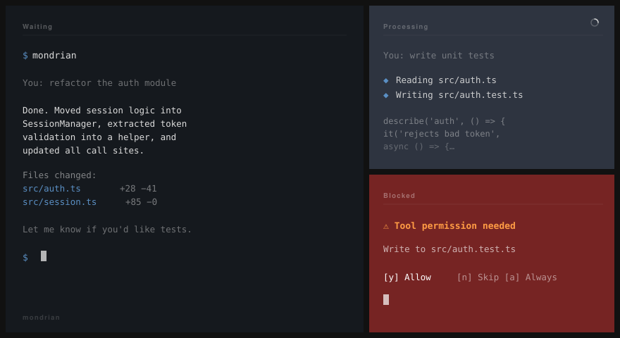

# mondrian



iTerm2 terminal background colorizer for [Claude Code](https://claude.ai/code). Changes your terminal's background color (and optionally transparency) based on what Claude is doing.

| State | When | Default |
|---|---|---|
| **Waiting** | Your turn — Claude is idle | Your normal terminal color |
| **Processing** | Claude is responding or using a tool | A color you pick |
| **Blocked** | Claude needs your input | Red/rose accent (optional) |

---

## Requirements

- macOS
- [iTerm2](https://iterm2.com)
- Python 3
- [Claude Code](https://claude.ai/code) CLI

---

## Install

```sh
git clone https://github.com/mariobollini/mondrian.git
cd mondrian
./install.sh
```

`install.sh` runs `mondrian configure` automatically. You can re-run it any time.

---

## Commands

```sh
mondrian configure   # phase-by-phase color setup
mondrian edit        # tweak processing/blocked colors, transparency
mondrian browse      # explore color schemes, manage bookmarks
mondrian status      # show current install state
mondrian apply       # re-apply saved config (after editing ~/.mondrian.json)
mondrian reset       # remove hooks and config, restore original colors
```

---

## Configure flow

`mondrian configure` walks through each state in order:

1. **Normal** — shows your current terminal colors; optionally customize
2. **Processing** — pick a color from a hue grid → see closest matching schemes → select one (or just use the hex)
3. **Blocked** — same picker for the permission-needed state; or disable it entirely
4. **Transparency** — optional fade while Claude works (window becomes semi-transparent while processing, snaps back when done)
5. **Review** — see all three states side by side, then confirm

---

## In-session editing

You can change mondrian settings live from within a Claude Code session — just ask:

> "set my processing color to Tokyo Night"  
> "turn off the blocked indicator"  
> "change active transparency to 40%"

Claude will edit `~/.mondrian.json` and run `mondrian apply`. Changes take effect on the next prompt.

---

## Transparency fade (optional)

During `configure`, answer `y` to the transparency prompt. You set the target opacity for the processing state — the window fades to that level while Claude works and snaps back when it's your turn.

Blocked/red state never changes transparency — it should be solid and attention-grabbing.

---

## How it works

Mondrian installs four [Claude Code hooks](https://docs.anthropic.com/en/docs/claude-code/hooks) into `~/.claude/settings.json`:

- **`UserPromptSubmit`** → sets processing colors (+ resets timing guard so blocked can fire this turn)
- **`PreToolUse`** → sets processing colors (snaps back from red the moment you approve a tool)
- **`Stop`** → stamps a timestamp, restores waiting colors
- **`Notification`** → sets blocked colors, but only if the `Stop` stamp is >3 seconds old (filters the spurious notification that Claude Code fires at the end of every normal response)

Colors are set via iTerm2's `\033]1337;SetColors=bg=,fg=,bold=,selbg=,selfg=\007` OSC sequence — all five fields at once. Transparency is set via AppleScript.

Background detection uses live OSC 10/11 terminal queries (not the iTerm2 plist), so it works correctly regardless of which profile is active or whether transparency is in use.
